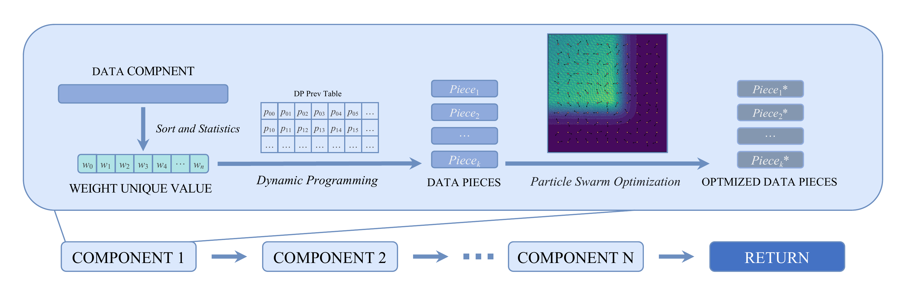

# _POUQ: A High-Precision Quantization via Segmentation and Swarm Optimization_

POUQ is a high-performance C library for vector quantization that combines advanced optimization techniques with SIMD acceleration to achieve superior compression and fast similarity search.



## Dataset

Moderate-scale datasets are available at https://www.cse.cuhk.edu.hk/systems/hash/gqr/datasets.html/

## Citation

If you use POUQ in your research, please cite:

```bibtex
@software{xin2025pouq,
  title={POUQ: A High-Precision Quantization via Segmentation and Swarm Optimization},
  author={Xin Hu},
  year={2025},
}
```
